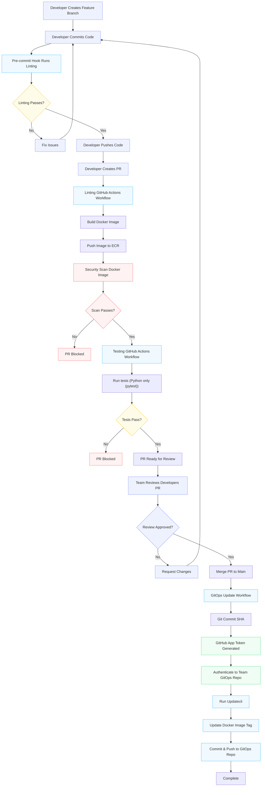

## Application Delivery

This directory documents the application source and delivery workflow for the platform. Application changes are validated in GitHub Actions, packaged as container images, pushed to Amazon ECR and promoted by updating the relevant team GitOps repository.

See the [root README](../README.md) for the platform architecture, prerequisites and repository-wide concerns.

The application source repositories intentionally use different languages to demonstrate that an EKS cluster can run independently deployed services as part of one distributed workload. The `vote-app` is a Python Flask service, the `results-app` is a Node.js and Express service, and the `worker-app` is a .NET background worker. They interconnect through shared runtime contracts rather than a shared implementation language.

## Source Architecture

The services follow the distributed voting pattern used throughout this demo:

- `vote-app` serves the voting interface, accepts votes at `/vote` and writes them to Redis through Redis Sentinel.
- `worker-app` consumes votes from Redis and persists them to PostgreSQL. It is a background service with no public HTTP endpoint.
- `results-app` reads the persisted vote totals from PostgreSQL, serves the results interface and broadcasts updates to connected clients through Socket.IO.

This arrangement demonstrates the service boundaries and communication principles that matter when workloads run on Kubernetes: each service can be built, packaged and deployed independently while still participating in the same application workflow.

Testing is deliberately focused on the Python service because Python is the language focus of this project. `vote-app` includes the implemented pytest and integration coverage used by its CI workflow. `results-app` currently retains a placeholder `npm test` command that exits with status `1`, and `worker-app` does not currently include a test framework or test suite. The exact checks remain repository-specific; the application READMEs are the source of truth for local development and validation commands.

## Inspiration and Extensions

All three application repositories extend the architecture and service pattern established by Docker Samples in the [`example-voting-app`](https://github.com/dockersamples/example-voting-app) project. That project provided the inspiration for demonstrating a distributed application composed of Python, Node.js, .NET, Redis and PostgreSQL services.

The EKS deployment model, Terraform infrastructure, ArgoCD and GitOps integration, repository structure, CI/CD workflows and the application extensions in these repositories are this project's own work. Credit belongs to Docker Samples for the original example and the foundation it provided for this demonstration.

To go directly to each of the App repositories, click any of the links below:
- [vote-app](https://github.com/grayburnd/vote-app)
- [results-app](https://github.com/grayburnd/results-app)
- [worker-app](https://github.com/grayburnd/worker-app)

## Application Delivery Architecture Overview

  The diagram shows the platform's intended application delivery path. The exact checks are repository-specific, so use each application README for the commands and current workflow behavior.
