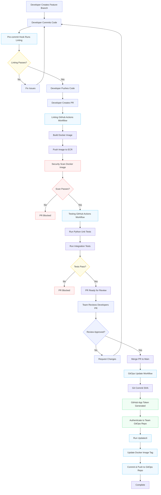

## Architecture Overview

```mermaid
---
config:
  layout: dagre
---
flowchart TB
    A["Developer Creates Feature Branch"] --> B["Developer Commits Code"]
    B --> C["Pre-commit Hook Runs Linting"]
    C --> D{"Linting Passes?"}
    D -- No --> E["Fix Issues"]
    E --> B
    D -- Yes --> F["Developer Pushes Code"]
    F --> G["Developer Creates PR"]
    G --> H["Linting GitHub Actions Workflow"]
    H --> I["Build Docker Image"]
    I --> J["Push Image to ECR"]
    J --> K["Security Scan Docker Image"]
    K --> L{"Scan Passes?"}
    L -- No --> M["PR Blocked"]
    L -- Yes --> N["Testing GitHub Actions Workflow"]
    N --> O["Run Python Unit Tests"]
    O --> P["Run Integration Tests"]
    P --> Q{"Tests Pass?"}
    Q -- No --> R["PR Blocked"]
    Q -- Yes --> S["PR Ready for Review"]
    S --> T["Team Reviews Developers PR"]
    T --> U{"Review Approved?"}
    U -- No --> V["Request Changes"]
    V --> B
    U -- Yes --> W["Merge PR to Main"]
    W --> X["GitOps Update Workflow"]
    X --> Y["Git Commit SHA"]
    Y --> Z["GitHub App Token Generated"]
    Z --> AA["Authenticate to Team GitOps Repo"]
    AA --> AB["Run Updatecli"]
    AB --> AC["Update Docker Image Tag"]
    AC --> AD["Commit & Push to GitOps Repo"]
    AD --> AE["Complete"]

     A:::devAction
     B:::devAction
     C:::cicd
     D:::decision
     E:::devAction
     F:::devAction
     G:::devAction
     H:::cicd
     K:::security
     L:::security
     M:::blocked
     N:::cicd
     Q:::decision
     R:::blocked
     T:::devAction
     U:::devAction
     V:::devAction
     X:::cicd
     Z:::gitops
     AA:::gitops
     AB:::cicd
     AC:::cicd
     AD:::cicd
    classDef devAction stroke:#818cf8,fill:#eef2ff
    classDef cicd stroke:#38bdf8,fill:#f0f9ff
    classDef security stroke:#f87171,fill:#fef2f2
    classDef gitops stroke:#4ade80,fill:#f0fdf4
    classDef decision stroke:#facc15,fill:#fefce8
    classDef blocked stroke:#f87171,fill:#fef2f2
```
