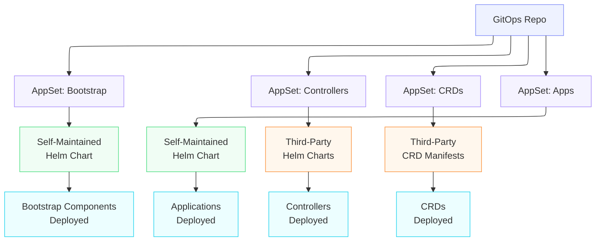
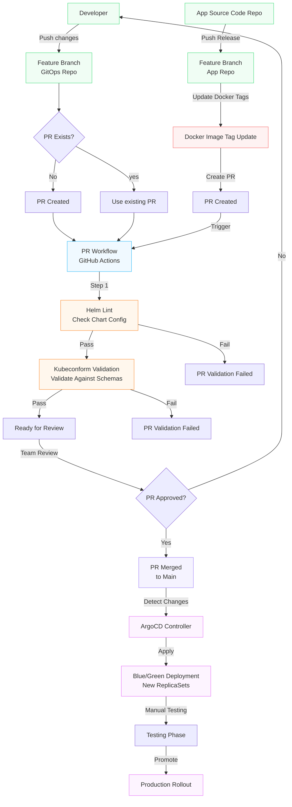

To go directly to each of the Teams GitOps repositories, click any of the links below:
- [backend-gitops](https://github.com/grayburnd/backend-gitops)
- [frontend-gitops](https://github.com/grayburnd/frontend-gitops)
- [platform-gitops](https://github.com/grayburnd/platform-gitops)
- [data-gitops](https://github.com/grayburnd/data-gitops)

## Architecture Overview

## GitHub Actions Workflow Overview

