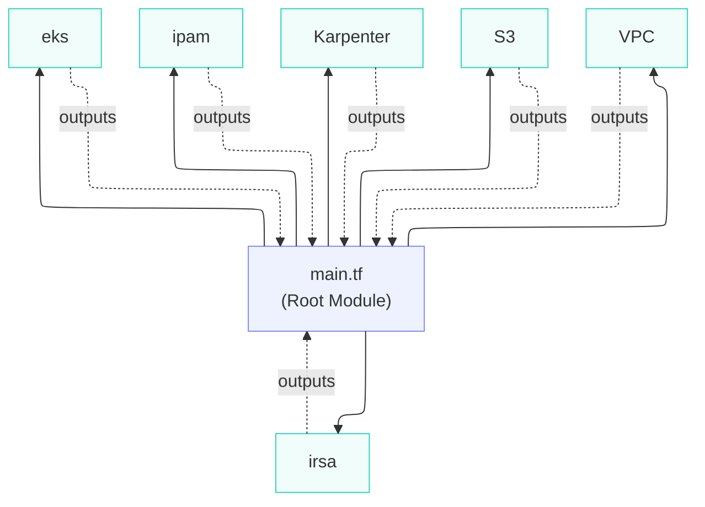

## Infrastructure as Code

This directory documents the Terraform infrastructure layer for the AWS EKS platform. The root module coordinates reusable modules for the cluster, networking, IP address management, IAM roles for service accounts, Karpenter and supporting storage resources.

See the [root README](../README.md) for the platform architecture, prerequisites and repository-wide concerns.

To go directly to the IaC repository, [click here](https://github.com/YOUR_GITHUB_ORG/aws)

## Architecture Overview

## GitHub Actions Workflow Overview

```mermaid
---
config:
  layout: dagre
  theme: default
---
flowchart LR
 subgraph PlanWorkflow["GitHub Actions: PR plan workflow"]
    direction TB
        Validate["Terraform validate"]
        Init["Terraform init"]
        Fmt["Terraform fmt"]
        Plan["Terraform plan"]
        Checkov["Checkov Terraform security scan"]
        GitLeaks["GitLeaks scan"]
  end
 subgraph ApplyWorkflow["GitHub Actions: main apply workflow"]
    direction TB
        Apply["Terraform apply"]
  end
 subgraph GitHub["GitHub"]
    direction LR
        PR["Create pull request"]
        Feature["Feature branch"]
        PlanWorkflow
        Review{"Review PR"}
        Merge["Merge pull request"]
        Main["main branch"]
        ApplyWorkflow
  end
 subgraph AWS["AWS"]
    direction TB
        Infra["Provisioned infrastructure"]
  end
    Dev(["Developer"]) --> Push["Push Terraform changes"]
    Push --> Feature
    Feature --> PR
    Fmt --> Init
    Init --> Validate
    Validate --> GitLeaks
    GitLeaks --> Checkov
    Checkov --> Plan
    PR --> PlanWorkflow
    Plan --> Review
    Review -- Approved --> Merge
    Merge --> Main
    Main --> ApplyWorkflow
    Apply -- Applies infrastructure changes --> Infra

     Validate:::checks
     Init:::checks
     Fmt:::checks
     Plan:::checks
     Checkov:::checks
     GitLeaks:::checks
     Apply:::deploy
     PR:::source
     Feature:::source
     PlanWorkflow:::workflow
     Review:::decision
     Merge:::deploy
     Main:::source
     ApplyWorkflow:::workflow
     Infra:::aws
     Push:::source
    classDef source fill:#eef2ff,stroke:#818cf8
    classDef workflow fill:#f0fdfa,stroke:#2dd4bf
    classDef checks fill:#f5f3ff,stroke:#a78bfa
    classDef decision fill:#fefce8,stroke:#facc15
    classDef deploy fill:#fff7ed,stroke:#fb923c
    classDef aws fill:#fff1f2,stroke:#fb7185
```

