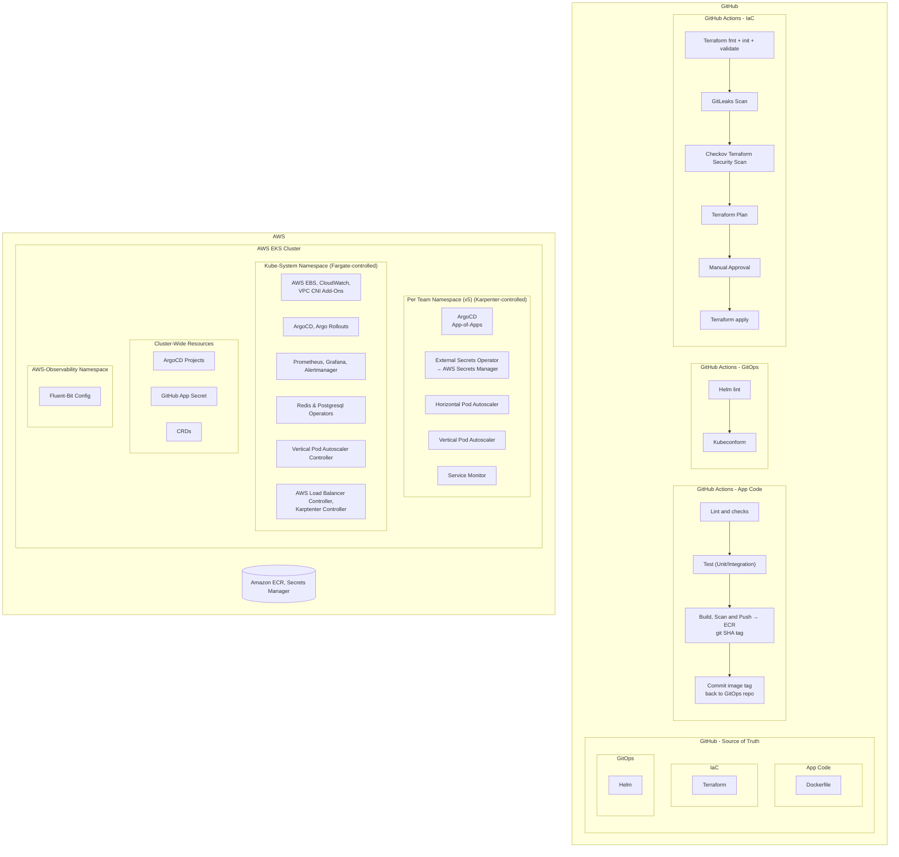

# AWS EKS GitOps Platform - Demonstration-Grade Kubernetes on AWS

> **A fully automated, Kubernetes platform on AWS EKS** built with Terraform, ArgoCD, and GitHub Actions, demonstrating DevSecOps, GitOps, observability, and advanced deployment patterns


---

## Architecture Overview



### Key Design Decisions

| Decision | Rationale |
|----------|-----------|
| **OIDC for GitHub Actions** | No long-lived AWS Credentials stored in GitHub |
| **App-of-Apps ArgoCD Pattern** | Follows the Dont Repeat Yourself (DRY) method for managing ArgoCD Applications at scale |
| **IRSA over node-level IAM** | Pod-scoped AWS permissions for least privilege per workload capabilities |
| **Fargate to Manage Third-Party Controllers** | Prioritizes operational simplicity/efficiency whilst trading off Cost Optimization benefits |
| **Karpenter over Cluster Autoscaler** | Provision diverse, optimal node configurations at scale whilst reaping cost optimization benefits through Kubernetes APIs |
| **External Secrets Operator** | Centralized, Encrypted Secrets Management with AWS Secrets Manager |
| **Redis Sentinel** | High Availability of the Redis Cluster to reduce downtime |
| **Argo Rollouts (Canary)** | Zero-downtime deployments, allowing for manual testing pre-promotion, with instant rollback capability |
| **Fluent-Bit forwarded App Logs** | Log aggregation in CloudWatch, allowing for long-term observability investigations and custom alarming based on logs. |
| **Databases managed by Operators** | Kubernetes native deployment, managed by Custom Operators to promote operational excellence |
| **Namespace per Team** | Each team deploys K8s resources which they manage into their own namespace, bring operational efficiency, following multi-tenant best practices |
| **ArgoCD Project per Team** | Ensures secure multi-tenancy by isolating developer blast radiuses at both the GitOps deployment layer and the Kubernetes cluster runtime layer |
| **Automated VPC IP Address management with VPC IPAM service** | Improves both operational efficiency and scalability of the Network, allowing for expansions into multiple VPC's in the future with full automation of the private Network Address Management layer |


---

## Prerequisites

| Tool | Version | Purpose |
|------|---------|---------|
| Terraform | >= 1.6 | Infrastructure provisioning |
| AWS CLI | >= 2.x | AWS authentication |
| kubectl | >= 1.36+ | Cluster management |
| Helm | >= 4.2 | Chart deployments |

---

## DevSecOps: Security Controls

### Secret Management (External Secrets Operator)

```
AWS Secrets Manager / SSM Parameter Store (source of truth)
          │
          ▼
  ExternalSecret CRD
          │
          ▼
  ESO Controller (authenticates to AWS via IRSA)
          │
          ▼
  Kubernetes Secret (controlled by ESO Controller)
          │
          ▼
  Pod environment variable / mounted volume
```

---

## Observability Stack

**kube-prometheus-stack** (Prometheus + Grafana + Alertmanager):

- **Metrics**: Cluster, node, pod, and application-level metrics
- **Dashboards**: Pre-built + custom Grafana dashboards (Kubernetes cluster, Sock-Shop SLOs)
- **Alerts**: Configurable for a move to Production

---

## Canary Deployments (Argo Rollouts)

The Demo App uses Argo Rollouts for zero-downtime canary deployments

---

## Infrastructure Costs (Estimated) [W.I.P]

> For cost savings during development, use `single_nat_gateway = true` in terraform.tfvars. [W.I.P]

---

## Main Technologies Used

| Category | Technology |
|----------|-----------|
| Cloud | AWS (EKS, ECR, VPC, EC2, IAM, Secrets Manager, SSM) |
| IaC | Terraform 1.6+, CloudFormation |
| Containers | Docker, AWS ECR |
| Orchestration | Kubernetes 1.36+, Helm 4 |
| GitOps | ArgoCD 3.5+ (App-of-Apps), Argo Rollouts (ArgoCD Extension) |
| CI/CD | GitHub Actions (OIDC auth) |
| Security Scanning | Trivy (Docker Image), GitLeaks, Hadolint (Dockerfile), Checkov (IaC)  |
| Network Security | AWS Security Groups |
| Secret Management | External Secrets Operator + AWS Secrets Manager |
| Observability | Prometheus, Grafana, Alertmanager |
| Autoscaling | Karpenter, HPA (CPU/memory) |
| Gateway API | AWS Load Balancer Controller |
| DNS | Route53 (optional) |

---
## Possible Improvements if Moving to Production
> IMPORTANT: Due to the scope of this repo being a demo, the improvements below are for reference only.

| Category | Improvement | Rationale |
|----------|-------------|-----------|
| Operational excellence | Deploy Kyverno into Cluster | Facilitates Governance at scale across the entire Cluster through Guardrails
| Security | Remove public endpoint access to the Cluster | Promotes defence in depth by ensuring the Cluster can only be accessed when connected to the hosting VPC privately
| Security | Implement network policies | Enforces network segregation, following network layer zero trust best practices
| Operational excellence | Migrate Redis and Postgres to AWS-Managed Services | Reduces the operational footprint of maintaing DB Services
| Reliability | Scale out all infra to multiple Availability Zones | Improves the availability of the application, making it resistent to disasters
| Operational excellence | Implement alerting for key app SLOs | Helps align resource focus to key SLI's, such as P99 Latency and detect issues before they occur

## Author

Built as a production-grade DevOps portfolio project demonstrating:
- Cloud-native infrastructure design (AWS EKS)
- GitOps methodology at scale (ArgoCD App-of-Apps)
- DevSecOps pipeline with shift-left security (Trivy, Checkov, Hadolint)
- Zero-downtime deployment strategies (Argo Rollouts)
- Day-2 operations readiness (observability, runbooks, HPA)